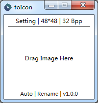

# toIcon

[https://github.com/xxxxst/toIcon](https://github.com/xxxxst/toIcon)

create ico file from image (.jpg | .png | .bmp | .ico)

create image from ico file

create image from system icon of any file or directory

---

## require

.net framework 4.5 or high

## locals

English | 简体中文

## programming language

C# | WPF


` `



` `


## run with console

use `ctoIcon.exe`

```
ctoIcon.exe [-s][-d][-t][-o][-b][-h]

  -s,--src          multiple source file. file1 file2 ...
  -d,--dst          out file directory, output to source directory if is empty
  -t,--type         out file type
                      optional: auto,ico,bmp,jpg,png. default is auto:
                      out png if src is ico
                      out ico if src is image
                      out png if src is orther file
  -o,--operate      operate when file exist
                      optional:rename,jump,overwrite
                      default is rename
  -b,--bppSize      size and bpp, multiple out split by ';', bpp can be ignore
                      usage: [size1],[bpp1];[size2]...
                      e.g. 48,32;24,16;64
                      default is 48
  -h,--help         help
```

---

## Dependencies
- FreeImage
- Fody

## license

GPL-3.0

[https://github.com/xxxxst/totIcon/blob/master/LICENSE.txt](https://github.com/xxxxst/totIcon/blob/master/LICENSE.txt)
